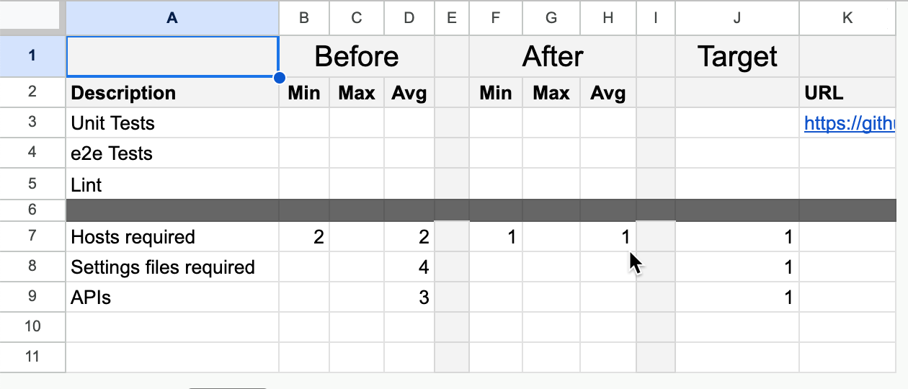
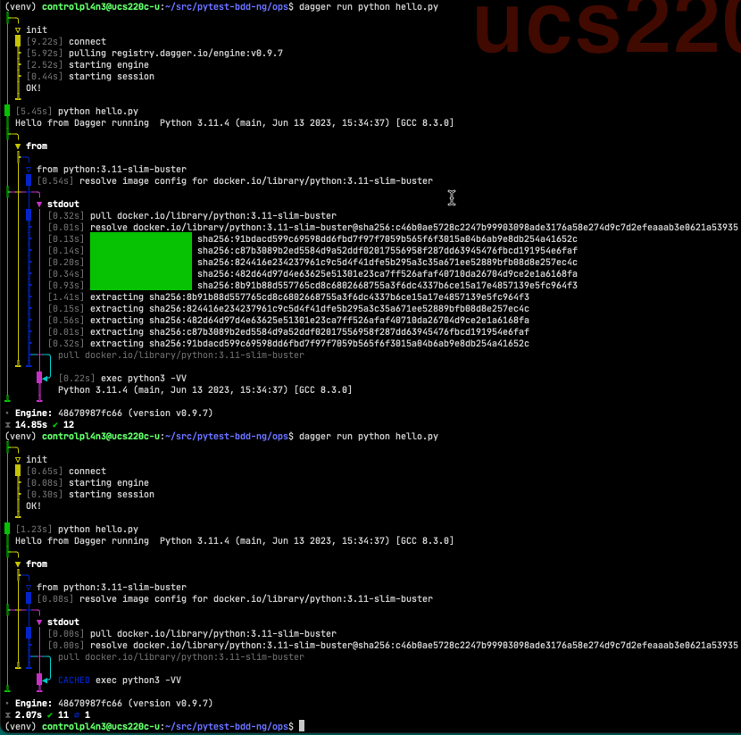

:slide-numbers: true

.. title:: Desert Island Daggerization

----

Desert Island Daggerization
===========================

An opinionated guide to refactoring legacy projects.

----

Why are you here?
=================

We want to offer you an opinionated guide to refactor existing projects.
Opinionated in the sense that propose a structure to help you get "80% of the bang for 20% of the buck"

----

What will we talk about?
========================

    * The project today
    * Challenges
    * Goals & Indicators
    * Hypothesis & Strategy
    * Results

----

What do we have to work with today?
===================================

    * Pytest-BDD-NG is a refactor of a pytest plugin for Cucumber.
    * Upstream does not have an official release of the python implementation.
    * Pytest-BDD has fallen behind the Upstream

----

Challenges
==========

    * Local build and test is cumbersome and difficult to reproduce
    * External dependencies pinned as repos in `.gitmodules <https://github.com/elchupanebrej/pytest-bdd-ng/blob/default/.gitmodules>`_
    * Depending on github actions means commit/push to github for every iteration.
    * Cycle time can be `as long as 29 minutes <https://github.com/elchupanebrej/pytest-bdd-ng/actions/runs/7401300495>`_
    * External Resources `can get expensive <https://github.com/elchupanebrej/pytest-bdd-ng/actions/runs/7401300495/usage>`_

----

Goals & Indicators
==================

Find the opportunities for improvement, starting with the **quick wins**
    * Reduced cycle time
    * Reduced number of APIs
    * Consolidated settings management
    * Accelerated iterations

----

Hypothesis
==========

Refactoring the automation using Dagger will achieve the goals and improve developer experience.

----

Step 0: Before we begin
=======================

Before we start, let's make sure that we have a machine with:
    * a local clone of the project repo
    * a working OCI runtime (Docker, Rancher, c-rio, containerd, Moby ...)
    * a working Dagger Engine, CLI and Python SDK
    * an Internet connection is recommended, but optional

----

Step 1 Inventory: Reverse engineering our project automation
============================================================

To get the lay of the land, start with the workflow because that will tell us the sequence of events, and where we spend the most time.
    * Workflow (pipelines, Makefiles, Dockerfiles)
    * Variables (settings, environments, secrets)
    * Dependencies (hosts, upstream repos, artifact repos)

----

Follow the workflow
-------------------

In this case, we start the journey with the GitHub Action

    * Main.yaml: Test, Build
    * Release: Main plus pushing artifacts out to PyPi

Note that the full build is a matrix build. On github it can take as much as 29 minutes.

----

Step 2: Create the dagger client
================================

Run a simple "Hello World" ``hello.py`` to make sure the infrastructure is in place.

----

First Quick Win: Caching
========================

The first run does the heavy lifting. Even a simple run doing barely any work takes 14 seconds.

----

and then the second run is a LOT faster!

---

Second Quick Win: Consolidate settings
=======================================

``settings.py`` for variables which you can then ``import`` into python.

----

Third Quick Win: (non)Custom Error Handling
===========================================

Plan for failure; custom exceptions will signal where your automation breaks.
Now you can extend your existing and familiar error handling into your CI automation.

----

Throw custom exceptions to let you know something failed
--------------------------------------------------------

This is an example of custom exceptions. You could also include telemetry and tracing.

.. code:: python
    class OpsError(Exception):
        """Base class for exceptions in the ops module."""
        pass

    class DaggerError(OpsError):
        """Base class for exceptions in the dagger module."""
        print(f'Something went {chr(0x1F4A9)} in your dagger code')
        pass

----

Run tests
---------

    * ``hello.py`` to make sure the client is working
    * ``main.py`` to run unit tests and do the workflow

----

Build the project
-----------------

``build.py`` to run build the project and run matrix tests.

----

Release a version
-----------------

``release.py`` to create packages for external consumption.

----

Conclusion
==========

Benefits
--------

.. class:: substep

    * Caching reduces time and resources

    * Fewer APIs

    * Fewer Hosts

    * Zero gitmodules

    * Custom Error Handling

----

Takeaways
=========

.. class:: substep

    * There is always something you can measure

    * Consolidate your variables

    * Leverage your existing testing and instrumentation

------

Keep Calm and Dagger On
=======================
